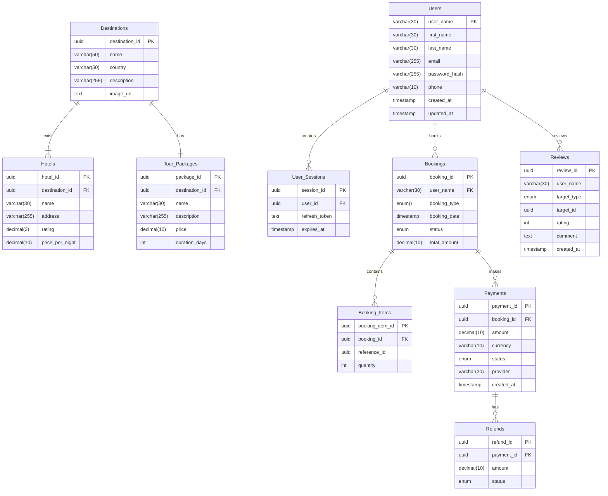

# Database Schema

This is an entity-relationship diagram of the travel_and_tourism application database.

```mermaid
erDiagram
    Users ||--o{ User_Sessions : creates
    Destinations ||--|{ Hotels : exist
    Destinations ||--|| Tour_Packages : has
    Users ||--o{ Bookings : books
    Bookings ||--o{ Booking_Items : contains
    Bookings ||--o{ Payments : makes
    Payments ||--o{ Refunds : has
    Users ||--o{ Reviews : reviews


    Users {
        varchar(30) user_name PK
        varchar(30) first_name
        varchar(30) last_name
        varchar(255) email
        varchar(255) password_hash
        varchar(10) phone
        timestamp created_at
        timestamp updated_at
    }

    User_Sessions {
        uuid session_id PK
        uuid user_id FK
        text refresh_token
        timestamp expires_at
    }

    Destinations {
        uuid destination_id PK
        varchar(50) name
        varchar(50) country
        varchar(255) description
        text image_url
    }

    Hotels {
        uuid hotel_id PK
        uuid destination_id FK
        varchar(30) name
        varchar(255) address
        decimal(2) rating
        decimal(10) price_per_night
    }

    Tour_Packages {
        uuid package_id PK
        uuid destination_id FK
        varchar(30) name
        varchar(255) description
        decimal(10) price
        int duration_days
    }

    Bookings {
        uuid booking_id PK
        varchar(30) user_name FK
        enum() booking_type
        timestamp booking_date
        enum status
        decimal(10) total_amount
    }

    Booking_Items {
        uuid booking_item_id PK
        uuid booking_id FK
        uuid reference_id
        int quantity
    }

    Payments {
        uuid payment_id PK
        uuid booking_id FK
        decimal(10) amount
        varchar(10) currency
        enum status
        varchar(30) provider
        timestamp created_at
    }

    Refunds {
        uuid refund_id PK
        uuid payment_id FK
        decimal(10) amount 
        enum status
    }

    Reviews {
        uuid review_id PK
        varchar(30) user_name
        enum target_type
        uuid target_id
        int rating
        text comment
        timestamp created_at
    }
```
